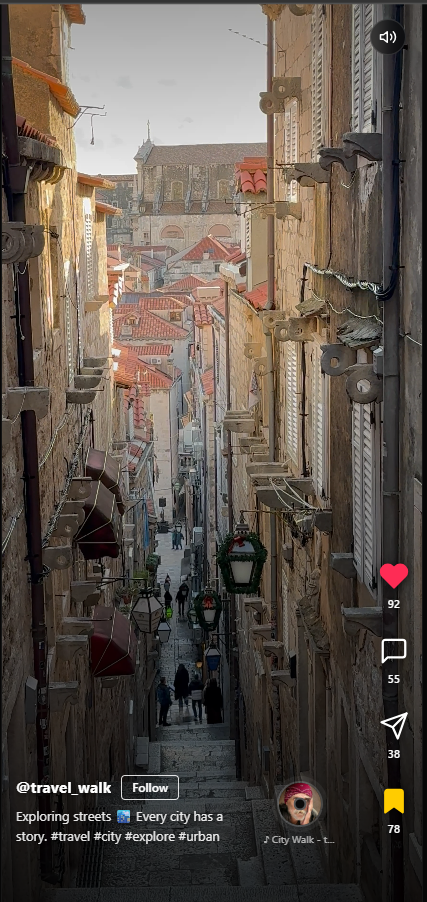

# TikTok Style Video Player

A responsive TikTok-style vertical video feed built using React.
This project replicates core reel functionalities such as auto-play, scrolling, likes, and comments.

---

## Demo Video

https://drive.google.com/file/d/1ROf9c60Lf-hO789HYBZTbMpYcbhRx7oI/view?usp=sharing

---

## Screenshot

(Add screenshot.png in the root folder)



---

## Features

* Vertical scroll video feed
* Auto play/pause using IntersectionObserver
* Like functionality (click and double tap)
* Comment modal
* Mute and unmute toggle
* Expandable caption (Read more)
* Infinite scrolling
* Responsive UI

---

## Tech Stack

* React (Vite)
* JavaScript
* CSS

---

## Setup Instructions

```bash
npm install
npm run dev
```

---

## Approach

* Used IntersectionObserver for detecting the active video
* Ensured only one video plays at a time
* Built reusable components for better structure
* Focused on smooth scrolling and user experience

---

## Limitations

* Uses static video data (no backend integration)
* Some videos are landscape and adjusted using responsive styling

---

## Author

Sneha Ojha
